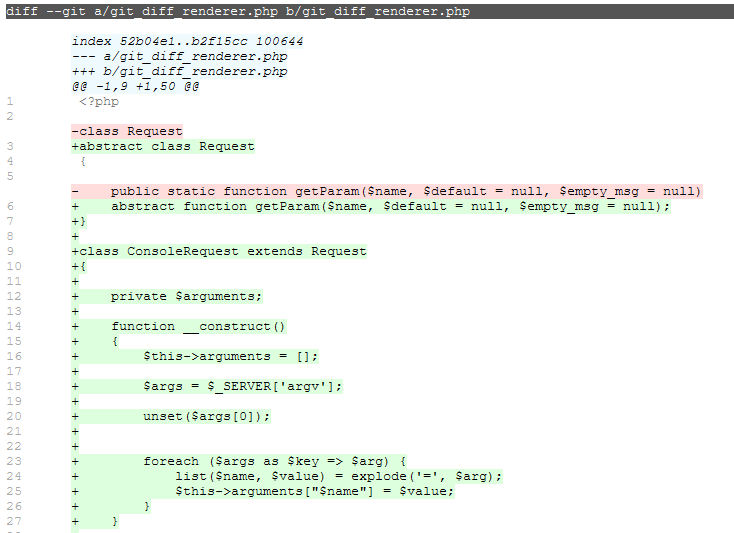

# git diff renderer

Use this script to `git diff` your repositories in HTML. Then you can copy the text keeping the format.


## Why

I had to audit some projects, checking the diff between the deployed versions and the codebase in GIT. After that, had to write a report for every project. 

Have you ever tried to keep the git diff's format? Of course you can use tools like Github compare, diffy.org, GitKraken or whatever, but you end up taking snapshots of the code (not cool).

If we're auditing text, then we want to keep the text, right? This script that takes advantage of the inherent power of the native git diff command and, of course, HTML.


## Usage

1. Clone the script in your public html folder.
2. Run it:
    - From your browser: Access to `http://localhost/git_diff_renderer/git_diff_renderer.php?path=path/to/your/git/repo/folder`. Replace `localhost` by a valid host.
    - From command line: `php -f git_diff_renderer.php path=path/to/your/git/repo/folder > output.html`




## Q&A

_Why inline styles?_
- Because most document editors don't understand CSS.

_What about Composer?_
- This library isn't conceived to be used as part of a project (please don't). So composer.. nope.


```
@@@@@@@@@@@@@@@@@@@@@@@@@@@@@@@@@@@@@@@@@@@@@@@@@@@@@@@@@@@@
@@@@@@@@@@@@@@@@@@@@@@.....................@@@@@@@@@@@@@@@@@
@@@@@@@@@@@@@.............. @@@@................@@@@@@@@@@@@
@@@@@@@@...................@@@@......................@@@@@@@
@@@@@........@@@@@@@@@@ .. @@@@@@@@@ ...@@@@@@@@@ ......@@@@
@@...........@@@ ****@@@@ @@@@ ***@@@@ @@@ ****@@@@ ......@@
@...........@@@@......@@@ @@@ ... @@@..@@@..... @@@ ......@@
@.......... @@@ ... @@@@ @@@@.... @@@ @@@ ... @@@@ .......@@
@@.........@@@@@@@@@@....@@@ ... @@@..@@@@@@@@@..........@@@
@@@@...... @@@ ......................@@@ ...............@@@@
@@@@@@@...    ......................     ............@@@@@@@
@@@@@@@@@@@....................................@@@@@@@@@@@@@
@@@@@@@@@@@@@@@@@@...................@@@@@@@@@@@@@@@@@@@@@@@
```
